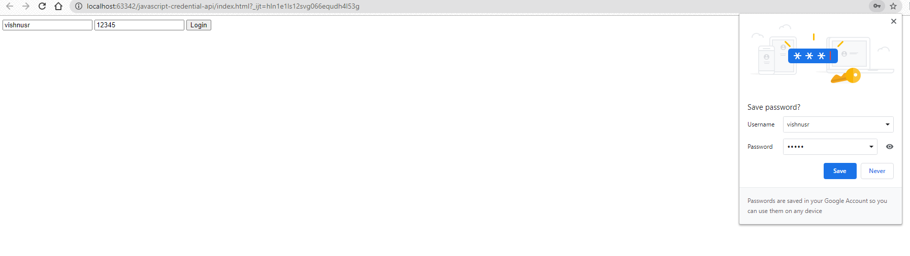
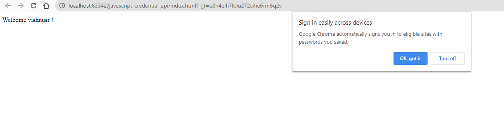
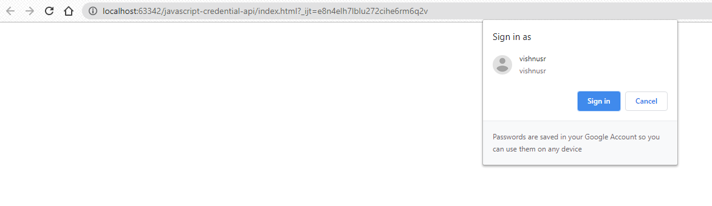

# Sample project to demonstrate credential api 

## PasswordCredential is an interface of the Credential Management API that provides information about username/password pair.

More info click [PasswordCredential](https://developer.mozilla.org/en-US/docs/Web/API/PasswordCredential)

### Before Login

### After Login

### Revisiting the page later
